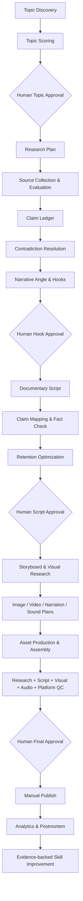

# AI Cinematic Micro-Documentary System

A research-first operating system for producing original AI-assisted cinematic documentaries for YouTube Shorts, Instagram Reels, and later YouTube long-form.

## Purpose

The repository turns credible research into structured documentary packages. It separates discovery, evidence, claim verification, storytelling, visual planning, production, quality control, publishing, and learning so that every important factual statement can be traced back to evidence.

The project is **not** an autonomous content farm. During Phase 1, humans select topics, approve hooks/scripts, review factual claims and reconstructions, approve final videos, and publish manually.

## Editorial positioning

Initial validation focuses on **Science + History + Mysteries**. Topics should have a clear question, strong explanatory value, cinematic/diagrammatic visual potential, credible source availability, and enough narrative structure to become a miniature documentary rather than a trivia list.

## Research-first philosophy

1. Research before scriptwriting.
2. Prefer primary and authoritative sources.
3. Track significant factual claims in a Claim Ledger.
4. Preserve uncertainty and disagreement.
5. Map script statements to Claim IDs where practical.
6. Never present AI reconstructions as archival evidence.
7. Human editorial review remains a blocking gate.

## Target formats

- YouTube Shorts: 20–60 seconds in Phase 1.
- Instagram Reels: 20–60 seconds in Phase 1.
- 3–5 and 6–10 minute YouTube videos: later phases, using successful Shorts as research assets.

## Current phase

**Phase 1 — Editorial Validation.** Target roughly 20–50 productions before major automation decisions. This is a guideline, not a performance benchmark.

## Core priorities

1. Factual accuracy
2. Strong storytelling
3. Audience retention
4. Visual quality
5. Originality
6. Production efficiency
7. Automation

Automation never outranks accuracy.

## Controlled production architecture

## Skill architecture

Every `skills/*/SKILL.md` follows one interface: Purpose → Inputs → Outputs → Responsibilities → Research Requirements → Rules → Quality Criteria → Failure Modes → Self-Check → Example → Performance Feedback → Version Notes.

Structured outputs are preferred so Skills can later be orchestrated without changing editorial policy. The Phase 1 production-ready core is:

`topic-discovery → topic-scorer → research-planner → source-evaluator → claim-extractor → fact-checker → narrative-angle → hook-writer → documentary-writer → retention-optimizer → storyboard-generator → visual-research → image-prompt-generator → video-prompt-generator → quality-control`

## Provenance model

A production should be able to answer:

- Why was this topic selected?
- Which sources support each major claim?
- What uncertainty or contradiction was found?
- Which Skill/version generated an output?
- Which Claim IDs entered the final script?
- Which visuals are reconstruction vs evidence?
- Which QC gate approved the package?
- What performance evidence justified a later Skill change?

## Repository map

- `brand/` — channel, audience, editorial and visual strategy.
- `skills/` — reusable production interfaces.
- `research/` — topic briefs, source packs, claim ledgers, fact checks and visual references.
- `templates/` — canonical structured artifacts.
- `prompts/` — optional invocation patterns; policy remains in Skills/docs.
- `production/` — work-in-progress and approved/published packages.
- `production/examples/VID-0001/` — full research-to-QC demonstration.
- `analytics/` — performance schema and evidence-backed learning log.
- `experiments/` — controlled tests.
- `workflows/` — human/AI handoffs and approval gates.
- `docs/` — canonical editorial, source, uncertainty, copyright, visual and compliance policy.
- `automation/` — provider-independent future design only; no autonomous publishing implementation.

## Human review requirements

Human approval is mandatory in Phase 1 for topic selection, hook selection, script approval, potentially controversial or sensitive claims, historical/scientific reconstructions, and final publishing. A `FAIL` QC result blocks publishing. `PASS WITH CHANGES` requires the listed changes and re-check before approval.

## Getting started

1. Read `PROJECT.md` and the canonical policies in `docs/`.
2. Follow `workflows/documentary-production.md`.
3. Duplicate canonical templates instead of inventing ad-hoc formats.
4. Review `production/examples/VID-0001/` to see the full pipeline.
5. Record real performance only in `analytics/performance.csv`; never seed fabricated metrics.
