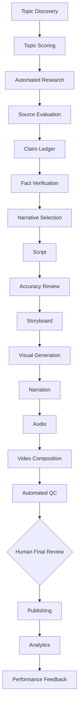

# Future Automation Architecture

Potential technology categories: LLM APIs, web/search APIs, scholarly APIs, image/video generation, speech synthesis, FFmpeg, YouTube/Meta APIs, object storage/database, GitHub Actions and workflow orchestration.

## Boundaries
- provider-independent interfaces;
- evidence artifacts persist before generation artifacts;
- human approval for factual/sensitive/reconstruction/final publishing gates;
- automation may propose, never silently downgrade an accuracy gate;
- no Phase 1 implementation of credentialed publishing.
